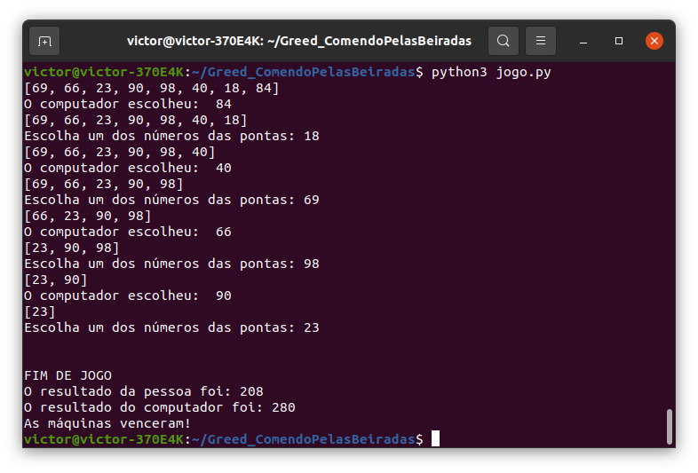
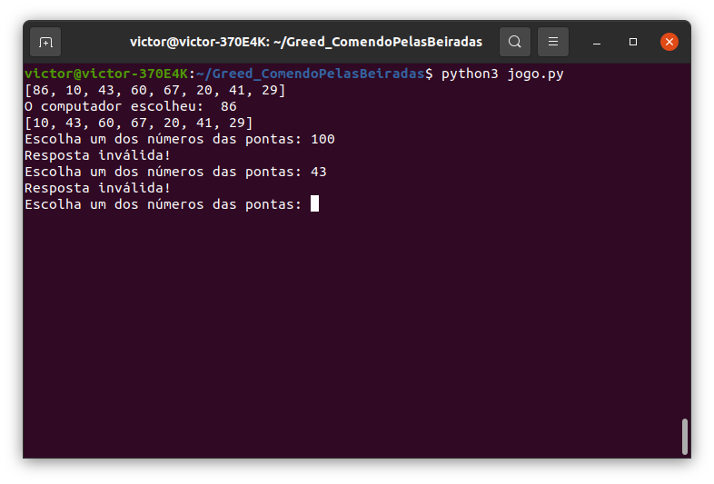

# Comendo pelas Beiradas
**Número da Lista**: 3  
**Conteúdo da Disciplina**: Algoritmos Ambiciosos  

## Alunos
|  Matrícula  |            Aluno           |
|    --       |             --             |
| 14/0031634  |  Stefânia Bezerra da Silva |
| 15/0150741  |  Victor Alves Gomide       |

## Sobre 

Surfando nas interwebs, encontramos um código em um [sítio eletrônico](https://www.geeksforgeeks.org/coin-game-of-two-corners-greedy-approach/?ref=gcse) que rascunhava um algoritmo guloso para sempre ganhar um jogo.

O jogo consiste de um conjunto de números. Cada jogador, no seu turno, escolhe um dos números das extremidades. Vence o jogador cujos números alcançarem a maior soma.

Como a webpágina não trazia a implementação do jogo, decidimos realizá-la, e utilizar o algoritmo guloso para criar um adversário (quase) invencível.

## Screenshots

O jogo acontece todo no terminal, como exemplificado nas capturas de tela abaixo:  
  

## Instalação 
**Linguagem**: Python 
**Framework**: Não foi utilizado 

**Passos para a instalação**:

1) Primeiramente o usuário deverá clonar o repositório:

`git clone https://github.com/projeto-de-algoritmos/Greed_ComendoPelasBeiradas`

2) Depois do repositório clonado, você deverá instalar o Python caso não tenha em sua máquina:

`sudo apt-get install python3`

## Uso 

Depois de instalar as dependências acima, o usuário precisará apenas compilar o código no terminal:

`python3 jogo.py`

#### Boa sorte tentando prevalecer do domínio intelectual do maquinário! MAUHAHAHAMAUHAHAHA!
